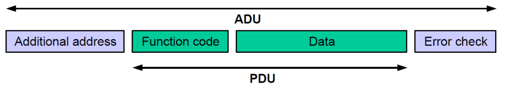
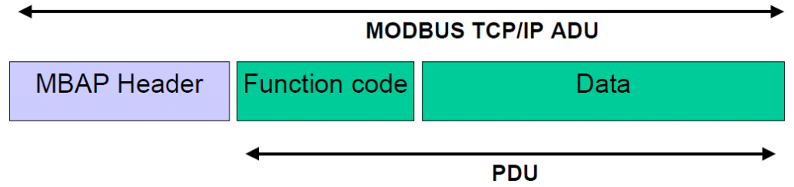
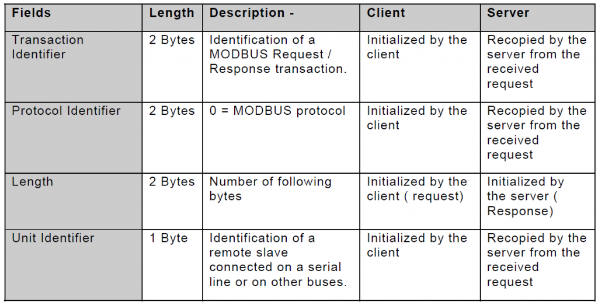

# Modbus TCP/IP for SIMOTION
**Date:** 2016-05-11

Although SIMOTION does not support Modbus out-of-the-box, it does support TCP/IP socket communication. Siemens has not made a library for Modbus TCP/IP, so when I needed one, I had to make it myself.

What is Modbus and how does it works? I started reading the Protocol Specification and then the TCP/IP Implementation Guide from [Modbus.org](http://www.modbus.org)

## Protocol Specification
This document describes the protocol and how it works, disregard of communication form. The Modbus protocol is a simpel protocol data unit called PDU that consists of a function code and some data.

The additional fields is added when mapping the protocol on different networks or busses. In this case we use TCP/IP.

## TCP/IP Implementation Guide

This document describes how to map the modbus protocol onto a TCP socket communication. When doing so an additional field is added called MBAP Header.

The MBAP Header contains;

## MODBUS TCP/IP Client for SIMOTION

The function block I made for SIMOTION only implements the functions codes 0x03 (Read Holding Registers) and 0x10 (Write Multiple Registers). Others I don’t need. I used the MB_CLIENT for S7-1200/1500 from Siemens as templates, hence the naming is similar and not following the programing style guide from PLCOpen.

Because we use TCP the function also requires the LCom Library for SIMOTION from Siemens. I could use the system functions for TCP but, it is just easier to use LCom since Siemens are maintaining it, and it works. It can be downloaded here:

https://support.industry.siemens.com/cs/ww/en/view/48955385

Also the help content provided in TIA Portal for the MB_CLIENT block can be used, as the parameters behave the same.
