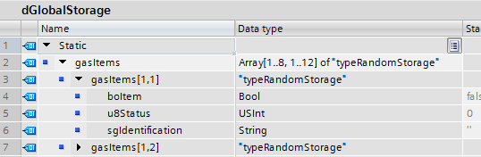
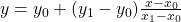
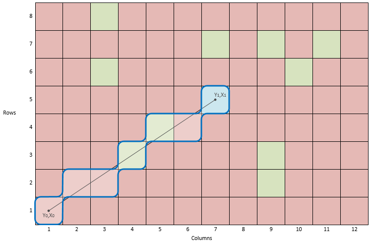
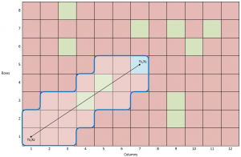
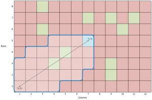
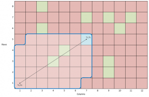
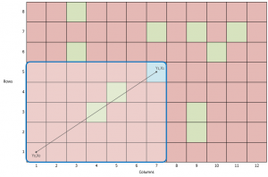
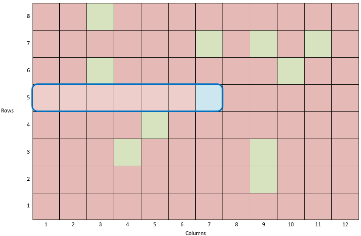
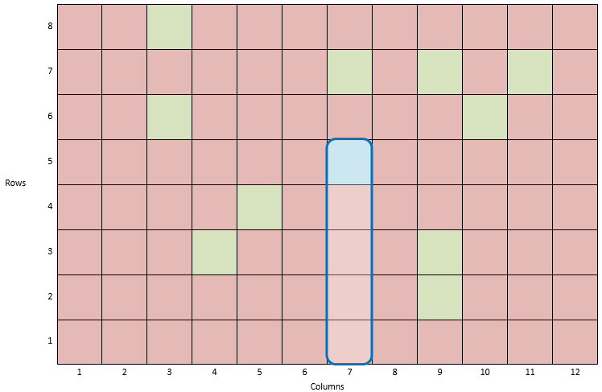

# Random Storage Algorithm for SIMATIC PLC
**Date:** 2016-03-25

>Randomized storage is used if an item can be stored at any empty location in the warehouse. There is no specific location where the products have to be stored, but in practice this strategy usually means that when an item arrives at the warehouse it will be stored at the nearest appropriate warehouse location.

This storage strategy is often used in fully automated storges units, and it is also what I will address in this post.

Just to clarify – I have no experience what so ever in storage solutions. This is just a thought that has evolved to a challenge that I find interesting and now I am making my first draft on how to solve this task made for a S7-1200/1500 PLC in TIA Portal.

My initial idea was to use a multi dimensional array for data storage. This can be a 3 dimensional array or 2 dimensional array depending on the physical layout of the storage unit. But I would prefer to use 2 dimensional array of a struct to make it fast and to make it more user friendly for other programmers than the author.



The code for running through this array looks like this;

```pascal
FOR #columns := 1 TO 12 DO
  FOR #rows := 1 TO 8 DO
    #data := "dGlobalStorage".gasItems[#columns,#rows];
  END_FOR;
END_FOR;
```

In this example I assume the same tool to be used for delivery and pickup on the storage crane/pick & place unit. So therefore we need to deliver an item before we can pick one up. We know the location where to pickup out item, so that location is our start point of finding the nearest free location. But because we have to deliver before pickup and we have a starting point we need to set up a set of rules to order the search pattern;

1. Search in a straight line from start point to end point (linear interpolation).
2. Search within the same row of the end point
3. Search within the same column of the end point
4. Search in a spiral (snail shell) starting in the end point

Now we know how many search patterns we need. I will make these as individual functions, and then call them in the main sequence. Then it is not that difficult to re-arrange the order if it makes sense. Example is that in a vertical storage it is faster to travel in horisontal lines because you have gravity on one axis, but in a vertical storage this is not an issue.

## 1. Search in a straight line from start point to end point (linear interpolation)

The search in a straight line from start to end can be done by linear interpolation. By knowing one axis (in this case the columns) we can interpolate the other axis (rows) with this equation;



Where  is starting point and  is ending point.



So by using the above mentioned equation we can interpolate the y values based on the x value. Now by rounding the result using tie-breaking rounding rule ([round half up](https://en.wikipedia.org/wiki/Rounding)) we get the integer part without fraction to be used in the array.

By widening the span of the search window in every cycle until either the endpoint row and column is reached or a free location is found the search area can be expanded;

 | 
------------ | -------------
 | 

```pascal
// Reset variables
#freeLocation.column := -1;
#freeLocation.row := -1;
#freeLocationFound := False;
#tempSearchCount := 0;
  
// Interpolate locations in the x-axis (columns)
IF (#startPoint.column < #endPoint.column) THEN
  FOR #tempColumn := #startPoint.column TO #endPoint.column DO
  //                   x - x0
  // y = y0 + (y1 - y0)-------
  //                   x1 - x0
  #tempIPOResult := INT_TO_REAL(#startPoint.row) +
                   (INT_TO_REAL(#endPoint.row) - INT_TO_REAL(#startPoint.row)) *
                   ((INT_TO_REAL(#tempColumn) - INT_TO_REAL(#startPoint.column)) / (INT_TO_REAL(#endPoint.column) - INT_TO_REAL(#startPoint.column)));
 
  #tempSearchCount := (#tempSearchCount + 1);
 
  #tempSearchLocations[#tempSearchCount].rowMin := DINT_TO_INT(ROUND(#tempIPOResult));
  #tempSearchLocations[#tempSearchCount].column := #tempColumn;
  #tempSearchLocations[#tempSearchCount].rowMax := #tempSearchLocations[#tempSearchCount].rowMin;
  END_FOR;
ELSE
  FOR #tempColumn := #startPoint.column TO #endPoint.column BY -1 DO
    //                   x - x0
    // y = y0 + (y1 - y0)-------
    //                   x1 - x0
    #tempIPOResult := INT_TO_REAL(#startPoint.row) +
                     (INT_TO_REAL(#endPoint.row) - INT_TO_REAL(#startPoint.row)) *
                     ((INT_TO_REAL(#tempColumn) - INT_TO_REAL(#startPoint.column)) / (INT_TO_REAL(#endPoint.column) - INT_TO_REAL(#startPoint.column)));
 
    #tempSearchCount := (#tempSearchCount + 1);
 
    #tempSearchLocations[#tempSearchCount].rowMin := DINT_TO_INT(ROUND(#tempIPOResult));
    #tempSearchLocations[#tempSearchCount].column := #tempColumn;
    #tempSearchLocations[#tempSearchCount].rowMax := #tempSearchLocations[#tempSearchCount].rowMin;
  END_FOR;
END_IF;
 
// Search loop
// A loop counter is added and checked against constant MAX_LOOPS to avoid
// an infinit loop causing cycle time exclusion
#tempSearchLoopCount := 0;
REPEAT
  // Loop counter
  #tempSearchLoopCount :=#tempSearchLoopCount + 1;
  
  // Loop thorugh all searches
  FOR #tempSearchIndex := 1 TO #tempSearchCount DO
    // Loop from rowMin to rowMax in a column based on the interpolation
    // 
    FOR #tempRow := #tempSearchLocations[#tempSearchIndex].rowMin TO #tempSearchLocations[#tempSearchIndex].rowMax DO
      // Debug: Add number to location for debugging
      IF (#storage.typeStorage[#tempRow,#tempSearchLocations[#tempSearchIndex].column].sgIdentification = '') THEN
        #storage.typeStorage[#tempRow,#tempSearchLocations[#tempSearchIndex].column].sgIdentification := INT_TO_STRING(#tempSearchLoopCount);
      END_IF;
  
      // Check if location is free
      IF NOT #storage.typeStorage[#tempRow,#tempSearchLocations[#tempSearchIndex].column].boItem THEN
        #freeLocation.column := #tempSearchLocations[#tempSearchIndex].column;
        #freeLocation.row := #tempRow;
        #freeLocationFound := True;
        RETURN;
      ELSE
        // Widen search span for next loop
        // Startpoint is left-down or right-down from end point
        IF
          ((#startPoint.column < #endPoint.column) AND (#startPoint.row < #endPoint.row)) OR
          ((#startPoint.column > #endPoint.column) AND (#startPoint.row < #endPoint.row))
        THEN
          // Only increment if it is below max row
          IF (#tempSearchLocations[#tempSearchIndex].rowMax < #endPoint.row) THEN
            #tempSearchLocations[#tempSearchIndex].rowMax := #tempSearchLocations[#tempSearchIndex].rowMax + 1;
          END_IF;
  
          // Only decrement if it is above min row
          IF (#tempSearchLocations[#tempSearchIndex].rowMin > #startPoint.row) THEN
            #tempSearchLocations[#tempSearchIndex].rowMin := #tempSearchLocations[#tempSearchIndex].rowMin - 1;
          END_IF;
        END_IF;
        // Startpoint is left-up or right-up from end point
        IF
          ((#startPoint.column < #endPoint.column) AND (#startPoint.row > #endPoint.row)) OR
          ((#startPoint.column > #endPoint.column) AND (#startPoint.row > #endPoint.row))
        THEN
          // Only increment if it is below max row
          IF (#tempSearchLocations[#tempSearchIndex].rowMax < #startPoint.row) THEN
            #tempSearchLocations[#tempSearchIndex].rowMax := #tempSearchLocations[#tempSearchIndex].rowMax + 1;
          END_IF;
 
          // Only decrement if it is above min row
          IF (#tempSearchLocations[#tempSearchIndex].rowMin > #endPoint.row) THEN
            #tempSearchLocations[#tempSearchIndex].rowMin := #tempSearchLocations[#tempSearchIndex].rowMin - 1;
          END_IF;
        END_IF;
      END_IF;
    END_FOR;
  END_FOR;
  
  // Check when to stop searching
  // Startpoint is left-down or right-down from end point
  IF
    ((#startPoint.column < #endPoint.column) AND (#startPoint.row < #endPoint.row)) OR
    ((#startPoint.column > #endPoint.column) AND (#startPoint.row < #endPoint.row))
  THEN
    IF ((#tempSearchLocations[1].rowMax > #endPoint.row) AND (#tempSearchLocations[#tempSearchCount].rowMin < #startPoint.row)) THEN
      EXIT;
    END_IF;
  END_IF;
  
  // Startpoint is left-up or right-up from end point
  IF
    ((#startPoint.column < #endPoint.column) AND (#startPoint.row > #endPoint.row)) OR
    ((#startPoint.column > #endPoint.column) AND (#startPoint.row > #endPoint.row))
  THEN
    IF (#tempSearchLocations[1].rowMin < #endPoint.row) AND (#tempSearchLocations[#tempSearchCount].rowMax > #startPoint.row) THEN
      EXIT;
    END_IF;
  END_IF;
UNTIL (#tempSearchLoopCount >= #MAX_LOOPS)
END_REPEAT;
```

## 2. Search within the same row of the end point

This is very simple. Just loop through all columns in the same row as the ending point, starting from the starting point column;



```pascal
// Reset output
#freeLocation.column := -1;
#freeLocation.row := -1;
#freeLocationFound := False;
  
IF #fullSearch THEN
  // Loop from starting point to endpoint
  FOR #tempRow := #minRow TO #maxRow DO
    // Debug: Add number to location for debugging
    IF (#storage.typeStorage[#tempRow, #endPoint.column].sgIdentification = '') THEN
      #storage.typeStorage[#tempRow, #endPoint.column].sgIdentification := INT_TO_STRING(1);
    END_IF;
  
    IF NOT #storage.typeStorage[#tempRow, #endPoint.column].boItem THEN
      #freeLocation.row := #tempRow;
      #freeLocation.column := #endPoint.column;
      #freeLocationFound := True;
      RETURN; // Stop search when found
    END_IF;
  END_FOR;
ELSE
  // If starting point is less than end point then increment search
  IF (#startPoint.row < #endPoint.row) THEN
    // Loop from starting point to endpoint
    FOR #tempRow := #startPoint.row TO #endPoint.row DO
      // Debug: Add number to location for debugging
      IF (#storage.typeStorage[#tempRow, #endPoint.column].sgIdentification = '') THEN
        #storage.typeStorage[#tempRow, #endPoint.column].sgIdentification := INT_TO_STRING(1);
      END_IF;
  
      IF NOT #storage.typeStorage[#tempRow, #endPoint.column].boItem THEN
        #freeLocation.row := #tempRow;
        #freeLocation.column := #endPoint.column;
        #freeLocationFound := True;
        RETURN; // Stop search when found
      END_IF;
    END_FOR;
  ELSE // Decrement search
    // Loop from starting point to endpoint
    FOR #tempRow := #startPoint.row TO #endPoint.row BY -1 DO
      // Debug: Add number to location for debugging
      IF (#storage.typeStorage[#tempRow, #endPoint.column].sgIdentification = '') THEN
      #storage.typeStorage[#tempRow, #endPoint.column].sgIdentification := INT_TO_STRING(1);
      END_IF;
  
      IF NOT #storage.typeStorage[#tempRow, #endPoint.column].boItem THEN
        #freeLocation.row := #tempRow;
        #freeLocation.column := #endPoint.column;
        #freeLocationFound := True;
        RETURN; // Stop search when found
      END_IF;
    END_FOR;
  END_IF;
END_IF;
```

## 3. Search within the same column of the end point

Same procedure as search within the same row;



```pascal
// Reset output
#freeLocation.column := -1;
#freeLocation.row := -1;
#freeLocationFound := False;
  
// If full search
IF #fullSearch THEN
  // Loop in all columns
  FOR #tempColumn := #minColumn TO #maxColumn DO
    // Debug: Add number to location for debugging
    IF (#storage.typeStorage[#endPoint.row, #tempColumn].sgIdentification = '') THEN
      #storage.typeStorage[#endPoint.row, #tempColumn].sgIdentification := INT_TO_STRING(1);
    END_IF;
  
    IF NOT #storage.typeStorage[#endPoint.row, #tempColumn].boItem THEN
      #freeLocation.row := #endPoint.row;
      #freeLocation.column := #tempColumn;
      #freeLocationFound := True;
      RETURN; // Stop search when found
    END_IF;
  END_FOR;
ELSE
  // If starting point is less than end point then increment search
  IF (#startPoint.column < #endPoint.column) THEN
    // Loop from starting point to endpoint
    FOR #tempColumn := #startPoint.column TO #endPoint.column DO
      // Debug: Add number to location for debugging
      IF (#storage.typeStorage[#endPoint.row, #tempColumn].sgIdentification = '') THEN
        #storage.typeStorage[#endPoint.row, #tempColumn].sgIdentification := INT_TO_STRING(1);
      END_IF;
  
      IF NOT #storage.typeStorage[#endPoint.row, #tempColumn].boItem THEN
        #freeLocation.row := #endPoint.row;
        #freeLocation.column := #tempColumn;
        #freeLocationFound := True;
        RETURN; // Stop search when found
      END_IF;
    END_FOR;
  ELSE // Decrement search
    // Loop from starting point to endpoint
    FOR #tempColumn := #startPoint.column TO #endPoint.column BY -1 DO
      // Debug: Add number to location for debugging
      IF (#storage.typeStorage[#endPoint.row, #tempColumn].sgIdentification = '') THEN
        #storage.typeStorage[#endPoint.row, #tempColumn].sgIdentification := INT_TO_STRING(1);
      END_IF;
  
      IF NOT #storage.typeStorage[#endPoint.row, #tempColumn].boItem THEN
        #freeLocation.row := #endPoint.row;
        #freeLocation.column := #tempColumn;
        #freeLocationFound := True;
        RETURN; // Stop search when found
      END_IF;
    END_FOR;
  END_IF;
END_IF;
```

## 4. Search in a spiral (snail shell) starting in the ending point

This approach search in an outgoing spiral starting at the ending point like a snail shell. The search igoing downward and to the left as a start finding the first free position closest to ;

```pascal
  // Reset
#freeLocation.column := -1;
#freeLocation.row := -1;
#freeLocationFound := False;
#tempDirection := #D_DOWN;
#tempCountDirectionChange := 0;
#tempAdd := 1;
#tempLoopCount := 0;
#tempRow := #endPoint.row;
#tempColumn := #endPoint.column;
  
// Spiral search loop
REPEAT
  // Loop counter (Only used for debugging)
  #tempLoopCount := (#tempLoopCount + 1);
  
  // Calculate addition and direction change
  IF (#tempCountDirectionChange = 2) THEN
    #tempAdd := (#tempAdd + 1);
    #tempCountDirectionChange := 0;
  END_IF;
  
  // Loop direction
  CASE #tempDirection OF
    #D_DOWN:
      #tempRow := (#tempRow - 1);
      // Count loops in this direction
      #tempDirectionCount := (#tempDirectionCount + 1);
      // Change direction
      IF (#tempDirectionCount = #tempAdd) THEN
        #tempCountDirectionChange := (#tempCountDirectionChange + 1);
        #tempDirectionCount := 0;
        #tempDirection := #D_LEFT;
      END_IF;
  
    #D_LEFT:
      #tempColumn := (#tempColumn - 1);
      // Count loops in this direction
      #tempDirectionCount := (#tempDirectionCount + 1);
      // Change direction
      IF (#tempDirectionCount = #tempAdd) THEN
        #tempCountDirectionChange := (#tempCountDirectionChange + 1);
        #tempDirectionCount := 0;
        #tempDirection := #D_UP;
      END_IF;
  
    #D_UP:
      #tempRow := (#tempRow + 1);
      // Count loops in this direction
      #tempDirectionCount := (#tempDirectionCount + 1);
      // Change direction
      IF (#tempDirectionCount = #tempAdd) THEN
        #tempCountDirectionChange := (#tempCountDirectionChange + 1);
        #tempDirectionCount := 0;
        #tempDirection := #D_RIGHT;
      END_IF;
  
    #D_RIGHT:
      #tempColumn := (#tempColumn + 1);
      // Count loops in this direction
      #tempDirectionCount := (#tempDirectionCount + 1);
      // Change direction
      IF (#tempDirectionCount = #tempAdd) THEN
        #tempCountDirectionChange := (#tempCountDirectionChange + 1);
        #tempDirectionCount := 0;
        #tempDirection := #D_DOWN;
      END_IF;
  END_CASE;
  
  // Check location
  IF
    (#tempRow <= #maxRow) AND
    (#tempRow >= 1) AND
    (#tempColumn <= #maxColumn) AND
    (#tempColumn >= 1)
  THEN
    // Debug: Add number to location for debugging
    IF (#storage.typeStorage[#tempRow, #tempColumn].sgIdentification = '') THEN
      #storage.typeStorage[#tempRow, #tempColumn].sgIdentification := INT_TO_STRING(#tempLoopCount);
    END_IF;
    // Check if location is free
    IF NOT #storage.typeStorage[#tempRow, #tempColumn].boItem THEN
      #freeLocation.row := #tempRow;
      #freeLocation.column := #tempColumn;
      #freeLocationFound := True;
      RETURN;
    END_IF;
  END_IF;
UNTIL (#tempLoopCount >= #MAX_LOOPS)
END_REPEAT;
```

By using these functions it is possible to make a prioritized search.
